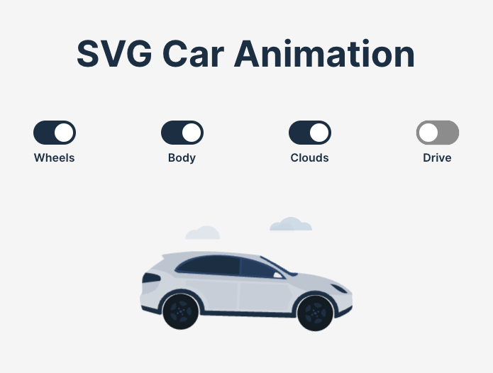

# Animatated SVG Car Component

This project provides a **very simple example** of how SVG animation can be done in React. The component is customizable and renders an animated SVG car, demonstrating basic animation techniques. The component allows for various animations, including body movement, wheel rotation, vertical motion, and the inclusion of animated clouds in the background.

